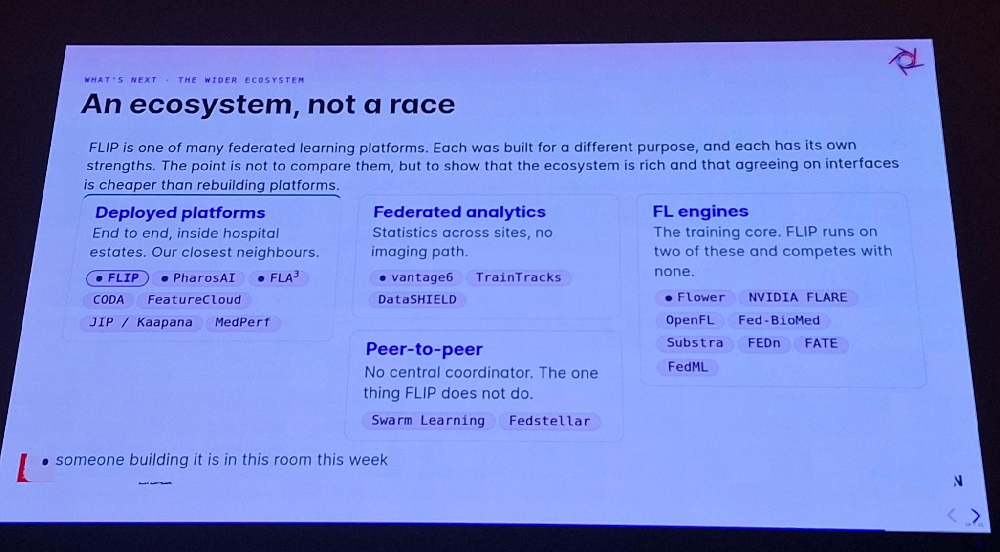
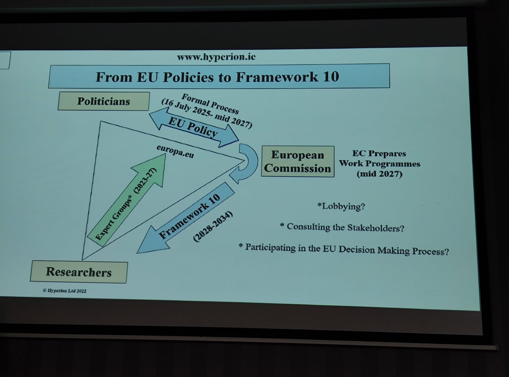

---
title:
layout: default
permalink: /misc/
published: true
---

## [Federated Learning in Healthcare System Workshop](https://luma.com/mm2ruxjk) & [Flower Collaborative Agent Hackathon](https://flower.ai/events/collaborative-agent-hackathon), Cambridge, 23–26 August 2026 {#fl-cambridge-2026}

From 23 to 26 August 2026, I had the chance to visit Cambridge, UK, to attend an FL hackathon and workshop. Cambridge is walkable, quiet, and full of academic atmosphere, with historic colleges, the beautiful [River Cam](https://en.wikipedia.org/wiki/River_Cam), and lovely bridges. It was a perfect place to pause, exchange ideas, and reflect on the current state and future of federated learning (FL).

The workshop focused on applying FL in healthcare systems. Many of the projects presented appeared to operate through established consortia, where hospitals, universities, and other institutions collaborate to train a shared model while keeping their data local. Agreements govern participation, access to the model, and, in some cases, how commercial benefits are shared. My impression was that making FL work in practice depends as much on these arrangements as on the learning algorithms themselves.

I was also interested in the campus applications presented, including [FedCampus 1.0 and 2.0](https://github.com/FedCampus), [FedKit](https://github.com/FedCampus/FedKit), and [ChatDKU](https://chatdku.com/). These examples prompted me to think about how FL and agentic AI could support students’ academic, administrative, and health needs while keeping sensitive data local. They also raised a question worth asking of such applications: where does collaborative learning happen, and where/how are agents simply coordinating queries or exchanging insights?

Beyond individual projects, I saw a growing FL ecosystem, including [FLIP](https://github.com/londonaicentre/FLIP) (see the photo below). FLIP supports federated training and evaluation across healthcare institutions using FL engines such as Flower and NVIDIA FLARE. As described at the workshop, its architecture uses secure environments at client sites and limits the information retained centrally.

   &nbsp;
  <small style="color:#666;">
  The FL platform landscape as presented at the workshop: deployed platforms, federated analytics, FL engines, and peer-to-peer approaches.</small>

These developments were encouraging, but they left me wondering how FL could become more accessible beyond established collaborations. Although FL already extends beyond healthcare and institutional consortia, many of the examples I encountered relied on agreements among a relatively small group of organizations. How could individuals and smaller organizations participate without first building such a consortium?

> Can we create an FL-based marketplace where individuals and organizations are rewarded for useful contributions from their local data and computing resources, while retaining control over how those contributions are used?

I imagine a platform where a buyer proposes a learning task, defines how model improvement will be evaluated, and invites eligible participants to contribute without transferring their raw data. In return, participants might receive payment, access to the trained model, or a share of the value it creates.

However, computation and data contributions should not be valued in the same way. A participant may perform substantial computation while contributing little new information, whereas a small dataset may contain rare and valuable examples. Broader participation could improve coverage and generalization, but this is not automatic: contributions must be relevant, and differences in data quality and distribution must be handled carefully. The challenge is to make participation accessible while ensuring that contributions are useful and rewards are fair.

These questions stayed with me during the hackathon organized by [Flower](https://flower.ai/), where we developed agent applications and deployed them on the [Flower SuperGrid](https://flower.ai/docs/framework/how-to-run-flower-apps-on-supergrid.html). It was exciting to team up with people from different backgrounds and build a prototype exploring how federated insights across facilities could support better post-operative outcomes for cataract surgery without sharing patient records across regions (see [Flower-Seed](https://github.com/linhnt31/hackathon_floweai_team) and the [Flower-Seed App](https://flower.ai/apps/linhnt/Flower-Seed)).

The emphasis on agentic AI initially made me wonder whether FL was struggling to find its own position amid the attention given to AI agents and LLMs. It sometimes feels as though every project needs these keywords nowadays. On reflection, however, becoming the backbone of other applications could be a strong position for FL. Like microservices, it could become widely used without being visible to end users. What matters is whether it enables useful learning and collaboration that would otherwise be difficult to achieve.

My vision is therefore an FL ecosystem that makes collaboration easier to enter, sustain, and leave. Participants should understand what they contribute, how they benefit, and what happens if they later withdraw. This connects directly to my research interests in incentives and federated unlearning: *if someone is rewarded for contributing and later requests the removal of their influence, who performs the unlearning, who pays for it, and how are the remaining participants affected?*

For me, these are central questions for the future of FL. Better algorithms matter, but broader adoption also requires credible rewards, clear participation rules, and meaningful control over contributions throughout their lifecycle.

## Research Ireland ADVANCE CRT Research Colloquium, 10th & 11th February 2026 {#advance-colloquium-2026}

I just had a wonderful time with my ADVANCE CRT friends and speakers during the Research Colloquium in the quiet city of [Portlaoise](https://maps.app.goo.gl/7pFsF2wcVbasgF4P7), where I had a chance to listen, learn, understand, and discuss Horizon Europe funding which is vital for the future careers of fresh PhDs in both academia and industry.

Here are a few lessons I personally observed and conceived from this event, naturally from my current perspective as a 3rd year PhD student.

+ I was provided with necessary skills and information to see the differences between Horizon Europe **PILLARS** and **WORK PROGRAMS**, how to search for information related to Horizon Europe funding calls, and how to read them efficiently to save time while grasping writers' key visions.

+ To have a competitive research proposal, we need to know ***who wrote the topics*** and what they are looking for (see the photo below). Specifically, they are politicians with broad and long-term visions, coming up with strategic plans (e.g., EU policies).

+ It is essential to choose the right partners with a proper matrix of skills, who can complement work packages and ***impacts*** from different perspectives that align with EU policies. 

   &nbsp;
  <small style="color:#666;">
  Photo taken from the talk of [Dr. Seán McCarthy](http://www.hyperion.ie/seanmccarthy.htm) in our event.</small>

## Research Ireland ADVANCE CRT 3rd Cohort Celebration, Oct. 2025

It has been a long time since I spent time writing about activities outside research. The year 2025 has been so busy so far with paper submissions, confirmation report after 18 months of PhD, and a placement at TU Delft (I actually wrote some diaries and reflections for this period, but I kept them private in Notion; I will release them in the near future).

At this moment, sitting in the Waterford Plunkett train station, I want to write down some of my thoughts about the event on the 28th and 29th of October in Waterford, at which we celebrated the graduation of the 3rd Cohort from my funding body, Research Ireland ADVANCE CRT. Waterford is the oldest city in Ireland, situated on the River Suir.

   &nbsp;
  <small style="color:#666;">
  Photo taken from the talk of [Dr. Sam Gregson](https://www.badboyofscience.com/about) in our event.</small>

It’s always a joy to meet people who share the same mindset and the same struggles of a PhD journey. With them, you don’t need to explain much about your work, challenges, or little moments of happiness; they simply understand. Over 2 days, here are a few things I heard from my peers, as well as talks from keynote speakers and the 3rd and 2nd cohorts.

+ I am happy to see people doing well, maintaining passion for their research, and maintaining good relationships with their supervisors.

+ Many also shared their struggles with loneliness and how they’ve learned to cope with it, e.g., working in the park, resting, traveling around, calling family, etc. While most people like working from home due to constraints like living far from the office or transportation issues, I also met people whose offices are similar to ours, where people enjoy coming to the office and talking to others ^^.

+ Your success often depends on having a kind supervisor, someone who treats you with mutual respect, listens, is patient, and truly cares about your growth.

> Last but not least, everyone has their own challenges and struggles, so **none of us are alone in this interesting yet demanding journey**. Be brave, stay resilient, and don’t hesitate to open up to people you trust, to seek advice, support, or simply a few words of encouragement.

## SFI ADVANCE CRT Research Summer School, Jun. 2024

From June 10 to 14, I had the privilege of attending a remarkable 5-day summer school organized by SFI ADVANCE CRT in the picturesque town of Killarney, County Kerry, Ireland. This intensive program offered two training tracks for PhD students: Social and STEM. What made this experience truly enriching was the interdisciplinary collaboration, where we formed groups with members from both tracks to propose case studies.

   &nbsp;

**Day-by-Day Learning Journey:**

+ Day #0: I traveled with my friend from Trinity College Dublin to Killarney. After lunch at [Muckross Park Hotel & Spa](https://www.muckrosspark.com/?gad_source=1&gclid=CjwKCAjw1K-zBhBIEiwAWeCOF6OjC_EYqY2k8kVrOaSTvzFu0Phe3tJeZCifI0FOoGw5NRNGvwPF6hoCxCUQAvD_BwE), we had two keynote speakers talking about the impacts of AI on Networking and society.

+ Day #1: We delved into Logistic Regression, Neural Networks, and Large Language Models (LLMs).

+ Day #2: The focus was on Reinforcement Learning.

+ Day #3: We explored Data Visualization techniques.

+ Day #4: We presented our group's case study. 

One of the highlights was working on a collaborative project where we proposed an LLM-based mobile application for mental health support. This application is designed as a supplemental tool, not for medical treatment. Collaborating with peers from various fields such as computer vision, e-Health, and neuro-psychology broadened my perspective and enhanced my learning experience.

**Exploring the Natural Beauty of Killarney**
Despite the intensive schedule, I made sure to enjoy the stunning nature around Killarney. Here are some of the memorable spots I visited:

+ [Killarney National Park ](https://www.nationalparks.ie/killarney/): A beautiful expanse of greenery and serene lakes.

+ [Muckross Abbey](https://en.wikipedia.org/wiki/Muckross_Abbey): A short visit to this historic site was quite enriching.

+ [Lough Leane](https://killarneylaketours.ie/): We took a delightful lake cruise, soaking in the scenic beauty of the islands.

Unfortunately, I couldn’t visit the [Torc Waterfall](https://www.kerrygems.com/kerry-gems-app/the-best-walks-in-kerry/torc-waterfall-walk/) this time, but I hope to return soon to explore more of this beautiful region.

Overall, this summer school was not only a great learning opportunity but also a chance to connect with amazing people and enjoy the breathtaking landscapes of Killarney.

## SFI ADVANCE CRT Research Colloquium, Apr. 2024

We had a great time at the Research Colloquium event organized by SFI ADVANCE CRT in Tralee, County Kerry. On the first day, we showcased our posters in a *presenters* and *hunters* format, where we could talk about research while receiving lots of advice and feedback from fellows. Besides, we participated in outdoor activities together, including pedalo boats, a climbing wall, and the Tower of Hanoi quizzes at [Tralee Bay Wetlands](https://traleebaywetlands.org/). On the second day, we had two sessions on entrepreneurship. I was quite impressed by the sharing on *how to think like an entrepreneur*, the mindset of *thinking ahead and focusing on scalability rather than just starting up*, and *insisting on doing hard/uncomfortable things* on the long-term road during the first session.

   &nbsp;

## SFI ADVANCE CRT Induction, Jan. 2024

You can find more details about my experience in this event [here](https://linhnt31.github.io/blog/AdvanceInduction24).

## SFI ADVANCE CRT Workshop, Nov. 2023

   &nbsp;
   &nbsp;
   &nbsp;
   &nbsp;

## 9th Vietnam Summer School of Science, Aug. 2022

   &nbsp;
   &nbsp;
   &nbsp;
   &nbsp;

